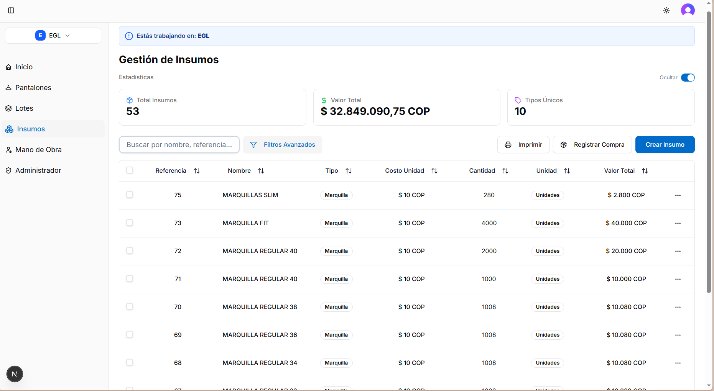
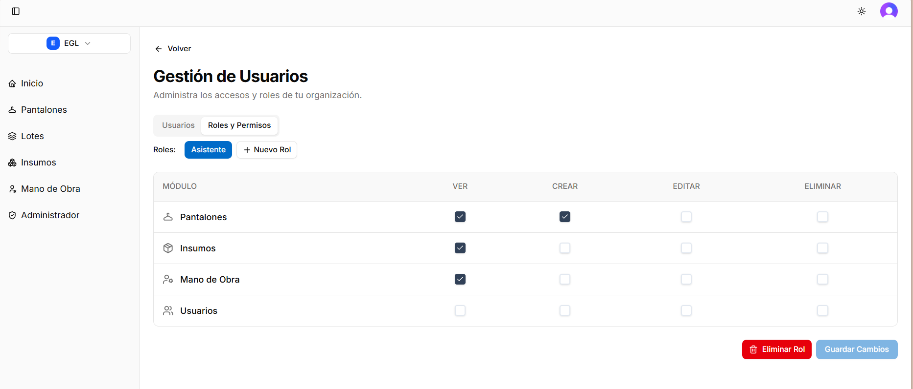

## Resumen

Desarrollé para EGL un SaaS multi-tenant para la gestión de inventario de producción de pantalones. La solución funciona como una plataforma vertical tipo ERP enfocada en inventario, lotes, insumos, mano de obra y administración por empresa. El proyecto comenzó como una etapa freelance y luego continuó como pasantía de trabajo de grado, completando cerca de seis meses de desarrollo entre octubre de 2025 y febrero de 2026.

La solución se enfocó en autenticación segura, control granular de permisos, aislamiento de datos por empresa y una experiencia de uso responsive para los distintos perfiles del sistema. El despliegue se realizó en Railway con Docker Compose.

## Alcance técnico

- Frontend construido con Next.js 16, TypeScript y Tailwind CSS.
- Arquitectura responsive con componentes reutilizables y feedback visual inmediato.
- Integración de Clerk para autenticación, roles y gestión de sesiones.
- Backend en Node.js y Express con PostgreSQL, Sequelize y validación de entradas.
- Modelo multi-tenant con separación de empresas y control de acceso por contexto.
- Gestión de insumos, pantalones, lotes, mano de obra y auditoría de actividad.
- Despliegue y operación continua en Railway con Docker Compose.
- Dominio y SSL gestionados con Cloudflare.
- Almacenamiento de imágenes y recursos en Backblaze B2(S3).

## Funciones clave

- Auditoría y seguimiento de cambios en los registros para mantener trazabilidad de la información.
- Lógica de negocio para altas de productos nuevos al inventario mediante promedio ponderado.
- Consistencia relacional entre datos.
- Gestión de inventario, lotes, insumos y mano de obra con CRUD completo.
- Generación e impresión de reportes operativos y fichas relacionadas con el inventario.
- Interfaz responsive adaptada a escritorio y móvil.
- Prácticas de seguridad con autenticación, permisos, headers, rate limiting y control de acceso.
- Separación de datos por empresa en bases independientes para evitar mezcla de información.
- Validaciones de datos tanto en frontend como en backend.

## Contexto del trabajo

Trabajé en dos etapas sobre el mismo producto: primero como freelance y después como pasantía de trabajo de grado. Mantengo ambas fases como una sola experiencia profesional porque corresponden al mismo SaaS, al mismo stack y al mismo objetivo de negocio.

## Capturas del sistema

