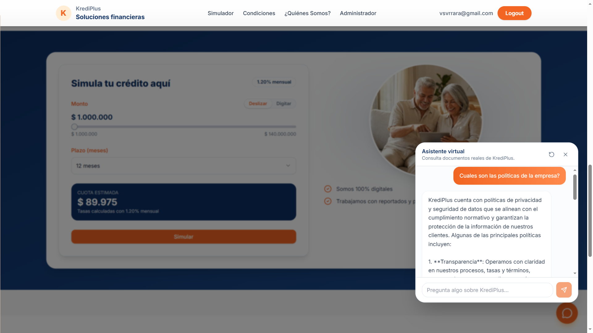
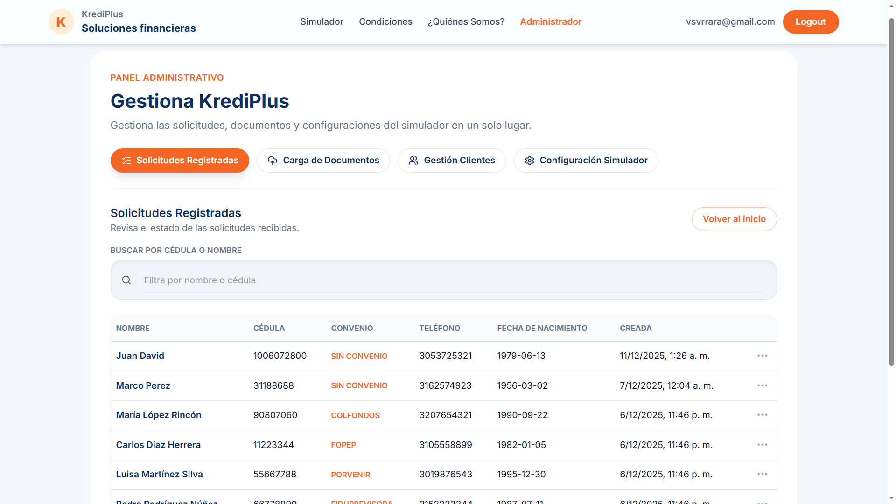

  ## Resumen del Proyecto
  Desarrollé KrediPlus, una plataforma web moderna orientada a la gestión y simulación de créditos. El mayor diferenciador de este sistema es la integración de un chatbot potenciado por un sistema RAG (Retrieval-Augmented Generation). Esto permite que los clientes resuelvan dudas instantáneas interactuando en lenguaje natural con la documentación oficial de la empresa (PDFs y documentos Word procesados automáticamente).

  ## Arquitectura y Retos Técnicos
  Para garantizar la escalabilidad y mantenibilidad a largo plazo, implementé decisiones de diseño avanzadas en ambas capas del proyecto:

  - **Arquitectura Hexagonal:** Construí la API del backend con FastAPI, separando la lógica de negocio mediante el patrón de puertos y adaptadores. Esto permitió que la generación de embeddings, la conexión a la base de datos PostgreSQL y las operaciones I/O fueran completamente asíncronas sin acoplar el código.
  - **Búsqueda Semántica Vectorial:** Uno de los mayores retos fue lograr que el chatbot entendiera el contexto financiero. Lo resolví fragmentando los documentos en *chunks*, almacenándolos en PostgreSQL con la extensión `pgvector`, y realizando búsquedas de similitud coseno utilizando los modelos de OpenAI.
  - **Frontend Modular:** Diseñé la interfaz del cliente y el panel administrativo utilizando *React 19* y *TypeScript* bajo una arquitectura basada en "features" (funcionalidades). Implementé *shadcn/ui* para garantizar un sistema de diseño sólido y accesible, gestionando el estado global de los usuarios con Zustand.
  - **Gestión de Contexto Conversacional:** Para mantener la coherencia del chatbot sin saturar la base de datos, implementé un mecanismo híbrido donde el historial se persiste temporalmente en el `sessionStorage` del cliente y se inyecta en el *prompt* de GPT en cada nueva petición al servidor.