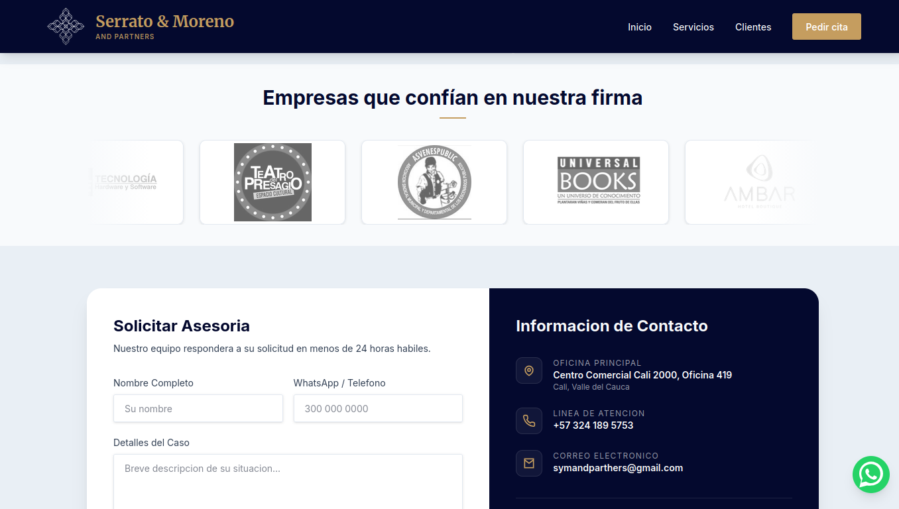
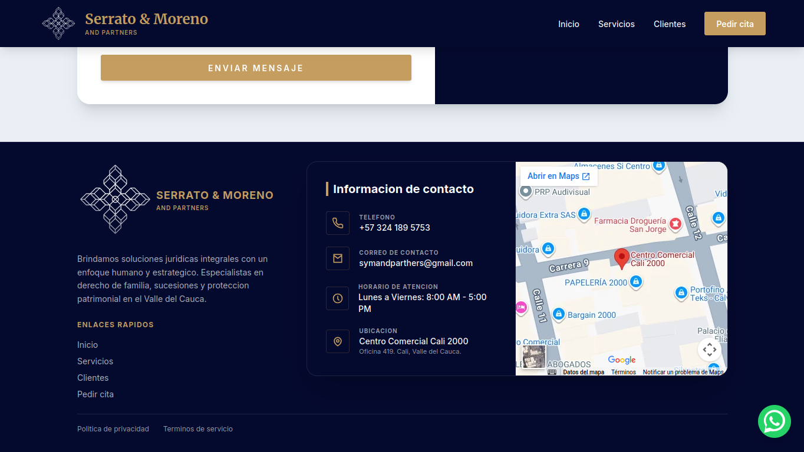
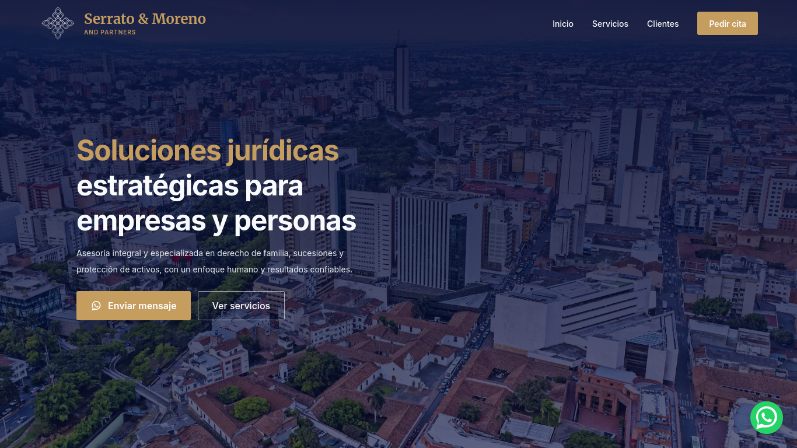

## Resumen del Proyecto
Desarrollé la landing corporativa para la firma de abogados Serrato & Moreno and Partners. El trabajo abarcó desde la toma de requerimientos, diseño visual y maquetado, desarrollo frontend hasta el despliegue final en Cloudflare Pages, incluida la configuración del dominio en Cloudflare y optimizaciones básicas de SEO.

Duración: 1 mes (Julio 2026).

## Arquitectura y Retos Técnicos

- **Next.js (App Router)** como framework para construir la landing estática/SSR según necesidades de SEO.
- **TypeScript + Tailwind CSS (v4)** para consistencia en el frontend y utilidades de diseño.
- **Integraciones de conversión:** enlaces a WhatsApp con mensajes predefinidos y formulario de contacto usando Formspree.
- **Despliegue y dominio:** despliegue en Cloudflare Pages y configuración del dominio comprado en Cloudflare (DNS, reglas básicas y certificados finales).
- **SEO técnico:** metadata Open Graph, JSON-LD para datos estructurados y optimización de meta tags para búsquedas locales en Cali y público en el exterior.

## Resultados

- Sitio en producción: https://www.smabogadoscali.com.co
- Entrega completa del frontend, con enfoque en conversión (CTAs, formulario y accesos a WhatsApp).
- Dominio configurado en Cloudflare y despliegue continuo en Cloudflare Pages.
- Mejora de presencia SEO local mediante metadata, JSON-LD y buenas prácticas de rendimiento.

## Capturas del proyecto

